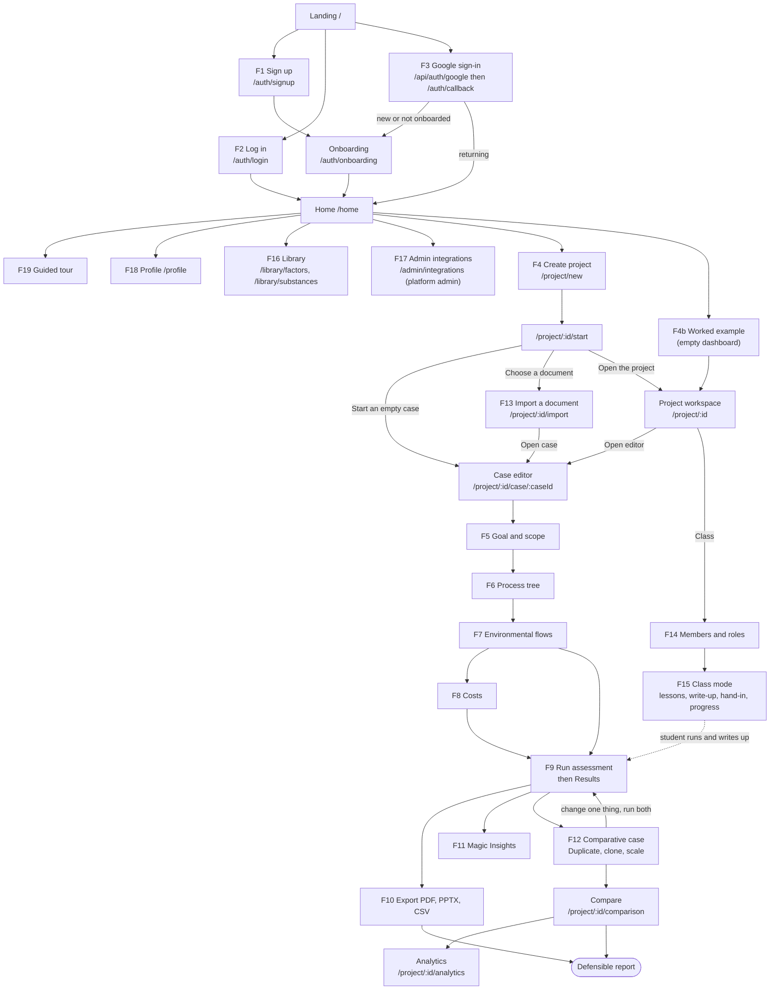

# LCAPIX user flows (canonical)

These are the end-to-end flows the next test phase is written against: API integration tests, authz tests, database tests, browser E2E and security tests.

- **Baseline:** read from branch `v1-hardening-kavish` @ `704a964`. That is the **pre-fix baseline**; six fix branches are in progress (`fix/auth`, `fix/authz`, `fix/editor`, `fix/factors`, `fix/platform`, `fix/runs`).
- **The branch moved during writing.** `v1-hardening-kavish` is now at `c4a7200`, with fix/authz, fix/platform, fix/auth and fix/runs merged; fix/editor and fix/factors are not. The flows below still describe the `704a964` baseline, as the brief asked.
  - A "**(merged at c4a7200)**" marker means a merge commit claims to fix that bug. This document did not re-verify those fixes.
  - The full ID list is in `flows.yaml#merged_fixes` and PERMISSIONS_MATRIX §6.
  - Two routes were added: `POST /api/auth/logout` and `POST /api/auth/google/session`. Both are covered here.
- **Current vs target:** where the code today differs from the intended behaviour, the step shows the **intended** behaviour and names the bug. Bug IDs refer to `docs/audit-2026-09-29/02-features-qa.md` (feature faults) and `01-security.md` (security findings).
- **Companion files:**
  - [`flows.yaml`](flows.yaml): the same flows in machine-readable form, plus the `permissions:` matrix that drives the generated tests.
  - [`PERMISSIONS_MATRIX.md`](PERMISSIONS_MATRIX.md): every API route × method × role.
  - [`TEST_PLAN.md`](TEST_PLAN.md): how each kind of test is built.

---

## 0. Conventions

### 0.1 Actors

| Actor | Meaning in code |
|---|---|
| **anonymous** | No `Authorization: Bearer` token. Pages redirect to `/auth/login` through the client-side `AuthGuard` (there is no `middleware.ts`). APIs answer 401. |
| **user / owner** | Signed-in `account` with `account_type='user'`. The **owner** of a project is `project.owner_id`, the account that created it. |
| **admin member** | `project_members` row with permission `admin` (project-level). |
| **editor member** | `project_members` row with permission `editor`. |
| **viewer member** | `project_members` row with permission `viewer`. |
| **instructor** | There is **no instructor role in code**. It means the person who manages the project's members on `/project/:id/class`, i.e. the owner (`canManage = isOwner`). See F15 for the two setups the code supports. |
| **student** | There is no student role either. A student is either a member of the instructor's project (Setup A) or the owner of their own project who shares it with the instructor (Setup B). |
| **platform admin** | `account.account_type='admin'`. It gives **no** access to other people's projects (`checkProjectAccess` ignores it). Once fix/authz lands it is required for the integration writers and the integration log. |

Role ranking inside a project (`lib/auth.ts:180-187`): owner 4 > admin 3 > editor 2 > viewer 1. "E+" in a step means editor or higher.

### 0.2 Step notation

Every flow has a steps table with these columns:

| Column | Content |
|---|---|
| **#** | step id, as referenced in `flows.yaml` |
| **Screen** | route, and the visible label of the relevant control |
| **Action** | what the user does |
| **API** | `METHOD /path`. "—" means no API call (listed again in §3.1). |
| **DB** | tables read (R) or written (W) |
| **Expected** | status code and resulting UI state |

Each flow closes with its success criteria, failure/edge cases, and the related known bugs.

### 0.3 Cross-cutting facts that apply to every flow
- **Auth transport:** the JWT is stored in `localStorage.auth_token` and the Zustand store `lcapix-auth`. `lib/api-client.ts` sends it as `Authorization: Bearer`. At the baseline the server never reads cookies; since `c4a7200` the only exception is the Google hand-off route `POST /api/auth/google/session`.
- **Cache-buster:** every `apiRequest` URL gets `?_t=<ms>` (`lib/api-client.ts:71-73`), so tests match on the pathname.
- **Session expiry:** a 401 from `apiRequest` clears `auth_token` and `user` and redirects to `/auth/login?error=session_expired`.
- **Error bodies:** `apiGet`/`apiPost`/`apiPut` don't check `res.ok`, so an error body is treated as data (X-API-1).
- **Toasts are invisible:** no `<Toaster/>` is mounted anywhere (X-UI-1). Any "toast" below is invisible today. Tests assert on inline text, the URL, or network responses instead.
- **No role-based UI:** the UI never hides or disables controls by role. A viewer sees every edit control and gets a 403 (usually reported only by an invisible toast).

---

## 1. Overview: how the flows connect

**Critical path** (what E2E must prove first): F1 → F4 → F5 → F6 → F7 → F9 → F10, then F12 → Compare. F13 is the alternative way into the case editor.

---

## 2. Flows

### F1. Sign up → onboarding → home

- **Goal:** a new person gets an account and lands on their dashboard.
- **Actor:** anonymous.
- **Preconditions:** the email isn't registered; there is no auth state in localStorage.

| # | Screen | Action | API | DB | Expected |
|---|---|---|---|---|---|
| F1.1 | `/auth/signup`: h1 "Create your account." | Fill **Name** `#fullName` (optional), **Email** `#email`, **Password** `#password` | — | — | Client validation shows "Email is required", "Please enter a valid email address", "Password is required", "Password must be at least 8 characters long", "Password must contain at least one number". The **Create account** button stays disabled until email and password are filled. |
| F1.2 | same | Click **Create account** | `POST /api/auth/signup` `{username, email, password}`. The client sends `username = fullName.trim() \|\| email local-part`. | W `account` | 201 `{success, user, token}`. Sets `localStorage.auth_token` and `user`, and `lcapix-auth.isAuthenticated=true`, then navigates to `/auth/onboarding`. |
| F1.3 | `/auth/onboarding`: "Tell us a little about you." | Page loads | `GET /api/auth/profile` | R `account` | 200 with `needsOnboarding:true` (because `full_name` is NULL). **Full name** is prefilled from the store name, which is the username. |
| F1.4 | same | Fill **Full name\***, **Company / organization\***, optional Role, **Primary use case** (select), Country; click **Continue to dashboard** | `PUT /api/auth/profile` `{fullName, company, role, useCase, country}` | W `account` (`full_name, company, role, use_case, country, onboarded_at=COALESCE(onboarded_at,NOW())`) | 200. The store name becomes the full name, then `router.replace('/home')`. |
| F1.5 | `/home` | Page loads | `GET /api/auth/profile`; `GET /api/projects`; `GET /api/integrations/status` | R `account`, `project`, `project_members`, `permissions`, `case_table`, `component`, `substances`, `driver_impact_factors`, `cost_rates`, `integration_log` | `[data-tour=home-greeting]` reads "Welcome back, &lt;first word of name&gt;." There are 4 tiles (PROJECTS, CASES, FACTORS, SUBSTANCES). Empty state: "Start your first assessment." with **Create your first project** and **Open the worked example**. |

**Success criteria:**
- One `account` row exists with `is_active=1`, `account_type='user'`, `full_name` and `company` set, and `onboarded_at` not null.
- The browser is on `/home` showing the greeting and the empty state.
- A second `GET /api/auth/profile` returns `needsOnboarding:false`.

**Failure and edge cases:**
- **400 "Email already registered":** shown inline in `[role=alert]`. This is account enumeration (L2).
- **400 "Username already taken":** happens when another user typed the same *full name*, because the name is sent as the username (AUTH-4). Target: the server derives a unique username and stores `full_name`.
- **Server password rule:** the server checks only length ≥ 8; the digit rule is client-side only.
- **Missing required onboarding field:** shows "Required." inline. A save failure is toast-only, so nothing visible happens (X-UI-1).
- **Already signed in:** a signed-in user who opens `/auth/signup` is not redirected away.
- **Schema drift:** on a DB built only from repo migrations, the profile columns don't exist, so `GET/PUT /api/auth/profile` answer 500 (AUTH-7).
- **Target, rate limit:** 429 after 3 signups per hour per IP (H5).
- **Target, email verification:** verify the address before Google linking is allowed (H3). No route exists yet.

**Known bugs:** AUTH-4, AUTH-6/L2, AUTH-7, AUTH-8 (no server-side email-format check; racy exists-then-insert), H5, X-UI-1.

---

### F2. Log in and log out (email)

- **Goal:** a returning user signs in, works, and signs out so the next person on the machine can't act as them.
- **Actor:** a registered user (any project role).
- **Preconditions:** the account exists and is active.

| # | Screen | Action | API | DB | Expected |
|---|---|---|---|---|---|
| F2.1 | `/auth/login`: "Welcome back." | Fill `#email`, `#password`; click **Log in** | `POST /api/auth/login` `{email, password}` | R `account` | 200 `{user, token}`. Sets `localStorage.auth_token` and `user`, and the store login (the store name is the **username**). Then navigates to `/home`. |
| F2.2 | `/home` | Loads | as F1.5 | as F1.5 | The greeting uses the username until the next profile or onboarding save (AUTH-4 cosmetic). The onboarding gate redirects to `/auth/onboarding` if the profile is incomplete. |
| F2.3 | any app page | Token expires, or the account is deactivated | any `apiRequest` → 401 | R `account` | `auth_token` and `user` are removed, then redirect to `/auth/login?error=session_expired`. The session-expired message is toast-only. `lcapix-auth.isAuthenticated` stays `true` (AUTH-5). |
| F2.4 | top bar **Account menu** → **Log out** | Click | Baseline: none. **Since `c4a7200`:** `POST /api/auth/logout` (R63; the top bar calls it with `keepalive`). | — | Clears `localStorage.auth_token` and `user`, sets `lcapix-auth` to logged out, then pushes `/auth/login`. **Target (M4, merged at c4a7200):** the response expires the `auth_token`/`user_data` cookies, and the persisted `lcapix-projects` store is cleared (AUTH-5). |
| F2.5 | `/home` after logout | Navigate | — | — | `AuthGuard` redirects to `/auth/login` with no `next` parameter. |

**Success criteria:**
- After F2.4, no `auth_token` remains in localStorage or cookies.
- Opening `/auth/callback` after logout does **not** sign anyone in.
- The next user who signs in on the same browser does not see the previous user's projects.

**Failure and edge cases:**
- **401 "Invalid email or password"** for a wrong password or an unknown email.
- **Inactive account:** the baseline returns 401 "Account is inactive. Please contact support." *before* the password check (AUTH-6, L2). Target (merged at c4a7200): a wrong password gives the generic 401; only a **correct** password on an inactive account gets **403** "Account is inactive…".
- **400** when email or password is missing.
- **`?error=` handling:** `?error=%25` crashes the page, because `decodeURIComponent` runs on an already-decoded value (AUTH-8). An arbitrary `?error=` string is shown verbatim in a (currently invisible) toast (L8).
- **No password reset or change** exists anywhere (AUTH-8, PROF-1).
- **Deactivated account with a still-valid token:** 401 on every route (PERMISSIONS_MATRIX §4; X-API-2 closed).
- **Token revocation:** changing the password hash (a password change, or a Google takeover) revokes every earlier token (`pv` claim); those tokens get 401.
- **Target, rate limit:** 429 after 5 attempts per minute per IP+email (H5).

**Known bugs:** AUTH-3, AUTH-5, AUTH-6, AUTH-8, M4, L2, L8, H5, X-API-2.

---

### F3. Google sign-in (state, verified email, linking rules)

- **Goal:** sign in or sign up with Google safely.
- **Actor:** anonymous.
- **Preconditions:** `NEXT_PUBLIC_GOOGLE_CLIENT_ID`, `GOOGLE_CLIENT_SECRET` and `NEXT_PUBLIC_APP_URL` are configured. In tests, Google is mocked (TEST_PLAN §7).

**Target behaviour** (what tests assert; FIX H3, AUTH-1..4, M4 on `fix/auth`):

| # | Screen | Action | API | DB | Expected (target) |
|---|---|---|---|---|---|
| F3.1 | `/auth/login` or `/auth/signup` | Click **Continue with Google** (sets `window.location.href = '/api/auth/google'`) | `GET /api/auth/google` | — | 302 to `accounts.google.com/o/oauth2/v2/auth` with `client_id`, `redirect_uri=${APP_URL}/api/auth/google`, `response_type=code`, `scope=openid email profile`, a **random `state`** (and optionally a PKCE `code_challenge`). Sets an **httpOnly, SameSite=Lax, ~10-minute state cookie**. No `access_type=offline` or `prompt=consent`. If unconfigured: 302 to `/auth/login?error=google_not_configured`. |
| F3.2 | Google consent | Approve | — | — | Google redirects to `/api/auth/google?code=…&state=…`. |
| F3.3 | server callback | — | `GET /api/auth/google?code&state`; server-to-server `POST oauth2.googleapis.com/token`, `GET www.googleapis.com/oauth2/v2/userinfo` | R/W `account` | **(a)** A missing or mismatched `state` redirects to `/auth/login?error=oauth_state_mismatch` and sets no session cookie. **(b)** `verified_email !== true` is refused (`error=google_email_unverified`). **(c)** Linking rules below. **(d)** Success: 302 to `/auth/callback?next=/auth/onboarding` (when `onboarded_at` or `company` is missing) or `?next=/home`. The session cookie is httpOnly (AUTH-3), and the state cookie is cleared. |
| F3.4 | `/auth/callback` | — | Since `c4a7200`: `POST /api/auth/google/session` (R64) | R `account` | The page exchanges the httpOnly, 2-minute `auth_token` hand-off cookie for `{token, user}`, and the response clears the cookie, so a replay gets 401. At the baseline the page read JS-readable 7-day cookies and never cleared them. `next` is limited to the allowlist `/home` and `/auth/onboarding`; anything else becomes `/home`. A failure redirects to `/auth/login?error=oauth_sync_failed`. |
| F3.5 | `/auth/onboarding` or `/home` | as F1.3–F1.5 | as F1 | as F1 | New Google users are prefilled with their Google name. |

**Linking rules (target):**
1. No account with the email: create one with a **server-derived unique username** (AUTH-4) and `full_name` from Google, then send the user to onboarding.
2. An account exists that was created through Google, or whose email is verified: sign in to it.
3. An active account exists with a password hash (a pre-registered password, or the random hash the old Google flow stored) and Google reports `verified_email: true`: **take over** the account (owner decision, fix/int-auth `9d72783`). Set `password_hash='!oauth-only'`, so the password stops working and every earlier session is revoked (`pv`), then sign in. Google has proved the caller owns the address, which also defeats a pre-registered attacker account (H3, AUTH-2). `error=use_password_login` is no longer produced.
4. `account.is_active = 0`: refuse with `error=account_inactive`, no token, and the account unchanged. This is checked before rule 3.
5. Needs schema support: there is currently no `email_verified_at`/`auth_provider` column and no migration for one. This is a prerequisite for fix/auth.

**Current behaviour** (baseline, `app/api/auth/google/route.ts`):
- No `state` or PKCE.
- Links to any existing account with the same email, whether or not it is verified or active.
- Sets `auth_token` and `user_data` cookies with `httpOnly:false` and a 7-day life; they are never cleared.
- `/auth/callback` copies them into localStorage, so after logout, visiting `/auth/callback` signs the previous user back in (M4).
- A second `jsmith@…` (different domain, same local-part) collides on the unique username and ends in `error=server_error` (AUTH-4).

**Success criteria (target):**
- A login-CSRF replay (an attacker's `code` with no or a foreign `state`) creates no session.
- An unverified Google email never gets a session.
- A victim's pre-registered password account is not silently taken over.

**Failure and edge cases:**
- Google returns `?error=access_denied`: 302 to `/auth/login?error=google_cancelled` (the baseline passed `access_denied` through; toast only).
- Token exchange fails: `?error=oauth_failed`.
- Userinfo fails: `?error=userinfo_failed`.
- Any exception: `?error=server_error`.

**Known bugs:** AUTH-1, AUTH-2, AUTH-3, AUTH-4, AUTH-8, M4, L8, X-UI-1.

---

### F4. Create a project (method, region, functional unit) and the worked example

- **Goal:** a user sets up a study and gets to where they can build its first case.
- **Actor:** a signed-in user, who becomes the **owner**.
- **Preconditions:** onboarded (F1).

| # | Screen | Action | API | DB | Expected |
|---|---|---|---|---|---|
| F4.1 | `/home` | Click **New project** `[data-tour=home-new-project]` (label "New project"; the tour text says "New Project"), or **Create your first project** on the empty dashboard | — | — | Navigates to `/project/new`: "Define an assessment." with the five-phase ISO rail. |
| F4.2 | `/project/new` | Fill `#projectName` "Project Name \*"; `#projectDescription` "Goal of the study"; `#functionalUnit`; `#boundary` (default `cradle-to-gate`; also `gate-to-gate`, `cradle-to-grave`); `#methodology` (default `CML 2001`; also `ReCiPe Midpoint (H)`, `TRACI 2.1`); `#region` (default `Global`; also `US`, `EU`) | — | — | **Create Project** is disabled while the name is blank. |
| F4.3 | same | Click **Create Project** | `POST /api/projects` `{project_name, description}` | R `project` (name clash); W `project`, `project_members` (owner row); R `permissions` | 201 `{project:{project_id…}}`. |
| F4.4 | same (automatic) | — | `PUT /api/projects/:id` `{lcia_method, region_code, functional_unit?, system_boundary?, goal_statement?}`. The FU and boundary are sent only when an FU was typed; the goal text is sent both as `description` in F4.3 and as `goal_statement` here. | W `project` (`lcia_method`, `region_code` via `canonicalizeRegion`, 014 goal columns) | 200, then navigates to `/project/:id/start`. |
| F4.5 | `/project/:id/start`: "How do you want to start?" | **Start an empty case** | `POST /api/projects/:id/cases` `{case_name:'Base case', case_type:'base', description:'Built by hand'}` | W `case_table` | 201, then navigates to `/project/:id/case/:caseId?learn=1` (lessons and Reference open). Alternatives: **Choose a document** → F13 (`/import?first=1`); **Open the project** → `/project/:id`. |
| F4.6 | `/project/:id` (workspace) | View | `GET /api/projects/:id`, `GET /api/projects/:id/cases`, then for the active case `GET /api/cases/:id/components`, `/assessments`, `/api/assessments/:runId`, `/completeness` | R `project`, `project_members`, `case_table`, `component`, `flows`, `assessment_runs`, `assessment_results` | `h1[data-tour=project-header]`; buttons **Analytics**, **Compare Cases** (disabled with fewer than 2 cases, with title "Needs two cases…"), **Class**, **Import Data**, **Add Case** `[data-tour=project-add-case]`, **Delete**; KPI tiles Cases / Steps / Global Warming / Cost; **Open editor** `[data-tour=project-open-editor]`. |

**F4b, the worked example:**

| # | Screen | Action | API | DB | Expected |
|---|---|---|---|---|---|
| F4b.1 | `/home` with **0 projects** | Click **Open the worked example** (the button shows "Building…" while running) | `POST /api/example-project` (no body) | R `project`, `substances`; W `project` (+ `lcia_method` `TRACI 2.1`, `region_code` `US`, goal), `case_table`, `component` (product "Painted steel bracket" + 3 operations with stages), `flows` (Steel 0.8 kg, Electricity 0.05/0.12/0.4 kWh, Argon 0.02 m3) | **200** `{project_id, case_id, points, skipped_substances}`, then navigates to `/project/:id`. A repeat call returns 200 with `existed:true`. |
| F4b.2 | workspace → editor | Open the case | as F5/F9 | — | **Target:** the project FU is "1 painted steel bracket, at the factory gate", cradle-to-gate, reference flow 1 bracket, so **Run is enabled**. **Today:** the route writes FU and boundary to `case_table`, which throws `ER_BAD_FIELD_ERROR`; the error is swallowed and the reference flow isn't written either, so Run stays disabled with "Set the functional unit (Goal & scope) before running" (PROJ-1). |

**Success criteria:**
- `project` has `owner_id` = the caller, the chosen `lcia_method`/`region_code`/`functional_unit`/`system_boundary`/`goal_statement`, and one `project_members` owner row.
- The browser reaches `/project/:id/start`, and then the editor with a base case.

**Failure and edge cases:**
- **409 duplicate name** for the same owner (case-insensitive and trimmed): shown inline under the name in `[role=alert]`.
- **400 empty name:** the UI prevents it.
- **Swallowed settings PUT (PROJ-3):** the PUT in F4.4 is called with `.catch(()=>undefined)` and its status is never read. If it fails (400/403/409, e.g. no migration 018), the study silently runs as CML/Global. Target: surface the error and keep the user on the form.
- **Non-transactional create (PROJ-2):** a failure between the project and member inserts leaves a half-built project. The example project also gets no owner `project_members` row.
- **Second base case (PROJ-6):** allowed by the API, but the UI shows only the first.
- **Workspace hard-codes:** the comparison banner values "−28.0% CO₂ · +$240" are hard-coded. The workspace **Run Assessment** always navigates to results, even when the run failed (PROJ-5). The tree-modal cost concatenates DECIMAL strings (PROJ-4).
- **No project rename or export** on the workspace (the API supports `project_name` on PUT).
- **Delete:** a native `confirm()` dialog, then `DELETE /api/projects/:id`. Owner only (403 "Only project owner can delete").

**Known bugs:** PROJ-1…PROJ-8, X-UI-1.

---

### F5. Goal & scope (ISO 14044 phase 1)

- **Goal:** state the functional unit, system boundary, goal, exclusions, and this case's reference flow and data basis, so results are "per" something.
- **Actors:** owner or admin member for the study-level fields; editor+ for the case-level fields.
- **Preconditions:** a case exists; migrations 014 and 018 are applied.

| # | Screen | Action | API | DB | Expected |
|---|---|---|---|---|---|
| F5.1 | Editor `/project/:id/case/:caseId`, card `[data-tour=case-goal-scope]` | Page load | `GET /api/projects/:id`, `GET /api/cases/:id` | R `project`, `case_table` | Collapsed row. It shows "Functional unit: … · Reference flow N unit · data basis … · &lt;boundary&gt;", or in red "Functional unit not set: needed before a run". The toggle reads **Set it** / **Edit** / **Close**. |
| F5.2 | same | Click **Set it**; fill **Functional unit**, **System boundary** (select), **Reference flow** (number + unit text "unit, e.g. bike"), **Data basis** (number), **Goal**, **Exclusions & cut-off** | — | — | The formula line reads "Results per functional unit = case total × a ÷ b". |
| F5.3 | same | Click **Save** | In parallel: `PUT /api/projects/:id` `{functional_unit, system_boundary, goal_statement, boundary_notes}` and `PUT /api/cases/:id` `{reference_flow, reference_flow_unit, modeled_output}` | W `project`; W `case_table`; W `component.quantity` of the root product when `modeled_output` is sent | Both 200 → "Goal & scope saved" (toast), the card collapses, and the Run gate re-evaluates. |
| F5.4 | Editor toolbar | Observe **Run Assessment** | — | — | Enabled only when an FU is set **and** completeness shows at least one impact layer (materials, energy, emissions or transport). Otherwise the title reads "Set the functional unit (Goal & scope) before running" or "Add at least one input or emission before running". |

**Success criteria:**
- `project.functional_unit`, `system_boundary`, `goal_statement` and `boundary_notes` are saved.
- `case_table.reference_flow` and `modeled_output` are > 0.
- The root product's `quantity` equals `modeled_output`.
- The next run's `run_snapshot.goal_scope` records them (F9).

**Failure and edge cases:**
- **Editor member:** the project PUT answers 403 (it requires admin), but the case PUT succeeds, giving a **partial save**. The UI message says "Only the project owner can change the study goal & scope.", although admins can.
- **Viewer:** both PUTs answer 403.
- **Invalid numbers:** reference flow or data basis ≤ 0 or non-numeric gives a client toast "Reference flow and data basis must be numbers above 0." and a server 400 "`reference_flow` must be a positive number".
- **Invalid boundary:** a value outside the three allowed gives 400.
- **Migration missing:** 409 "…needs migrate-014". If the columns are missing, the card renders nothing and nothing is gated.
- **Stale inspector (EDIT-8):** after the data basis is saved, the next inspector Save sends the stale product quantity and reverts it.
- **Unenforced gate:** the functional-unit gate exists only in the UI. `POST /api/cases/:id/assessments` accepts a case with no FU. Decide whether the server should enforce it (see F9).

**Known bugs:** EDIT-8, GS-1, GS-2, PROJ-1, X-UI-1.

---

### F6. Build the process tree (5 tiers)

- **Goal:** model the product as Product → Machine/Line → Subprocess → Operation → Elemental task. Covers add, edit, re-parent, delete (subtree or keep children), life-cycle stage and quantities.
- **Actor:** editor+ (delete is admin+ today; decision D5).
- **Preconditions:** a case exists.

| # | Screen | Action | API | DB | Expected |
|---|---|---|---|---|---|
| F6.1 | Editor, empty tree | Page loads | `GET /api/cases/:id`, `/components`, `/completeness`, `/assessments`; `GET /api/projects/:id`, `/api/projects/:id/cases` | R `case_table`, `component`, `flows`, `substances`, `assessment_runs`, `project` | The canvas shows "No components in this case yet." with **Create your first component**. The toolbar has the view switch **Tree / List / Plot** (target label "Graph"), search, **Reset**, **Learn**, **Reference**, **Duplicate**, **Run Assessment**. |
| F6.2 | Sidebar **Add Component**, or **Create your first component** | Click | — | — | Navigates to `…/component/new[?parent=<id>&type=<childType>]` and opens the modal (`role=dialog`, name "New component"). |
| F6.3 | Modal "New Component" | **Process tier** radiogroup (`aria-label="Component type"`: Product, Machine/Line, Subprocess, Operation, Elemental); **Parent component** select (not for Product); **Name \***; Description; **Quantity**; **Unit**. Click **Create component**. | `POST /api/cases/:id/components` `{component_name, component_type ∈ product/machine_line/subprocess/operation/elemental_task, parent_component_id, description, quantity, unit, drivers?, driver_category?, opex?, capex?}` | W `component` (`hierarchy_level` = parent level + 1) | 201. Fires `lcapix:components-changed` and the page refetches (the whole editor remounts, EDIT-6). The node appears in the sidebar, the canvas, and List view. Repeat for each tier. |
| F6.4 | Inspector | Select a node; edit **Name**, **Description**; for the Product, **Quantity**/**Unit**; **Placement → Parent** (the only way to re-parent; dragging does not); **Life-cycle stage** (Materials, Production, Distribution, Use, End of life); **Allocation**; click **Save** | `PUT /api/components/:id` `{component_name, component_type, component_description, parent_component_id, quantity, unit, …costs, allocation_method/factor/note, life_cycle_stage}` then `GET /api/cases/:id/components` | W `component` | 200 "Component updated successfully". **Target:** the stage round-trips. **Today** it is never loaded or sent (EDIT-2), so it always shows Production. |
| F6.5 | Inspector (Product) | Change the product quantity and Save | `POST /api/cases/:id/scale` (via ScaleDialog, see F12.4), then `PUT /api/components/:id` | W `flows`, `component`, `case_table.modeled_output` | See F12.4. |
| F6.6 | Inspector footer **Delete** | Click → `confirm('Delete "<name>"? …')`. If the node has children, a second `confirm`: OK = cascade, Cancel = keep children as floating. | **Target:** `DELETE /api/components/:id` (subtree), or `PUT /api/components/:child {parent_component_id: <grandparent or null>}` for each child, then `DELETE`. **Today:** none. | W `component` (cascade: children, `flows`, and **historical** `assessment_results`, RUN-1) | **Target:** the node (and subtree) is gone after a reload; with "keep children" the children move up a level. **Today:** only Zustand is updated; the node stays on screen and in the DB (EDIT-1). Target UI per the design brief: a dialog with "Delete subtree", "Keep children (move up)" and "Cancel". |
| F6.7 | Canvas | Click to select; drag a node; drag empty space to pan; Ctrl/⌘ + wheel to zoom (25–300%); **Fit**, **Reset layout**; search dims non-matches | — | — | Positions last for the session only; there is no API call and no re-parenting. |
| F6.8 | **List** / **Plot** views | Switch | — | — | List columns: Component, Type, Flows, Cost, Tree depth (`L<n>`). |

**Success criteria:**
- Five `component` rows, each tier's `parent_component_id` pointing at the tier above, all in the same `case_id`.
- `hierarchy_level` equals the depth.
- `life_cycle_stage` is stored.
- Delete removes the rows (and, per decision, either cascades or re-parents the children).

**Failure and edge cases:**
- **400** "Component name and type are required" / "Invalid component type".
- **Client validation:** "A Product already exists. Each case can only have one root Product.", "Pick the step this belongs under…", "A component cannot be its own parent.", "Cannot move a component under one of its own descendants."
- **Cross-case parent (M1/FLOW-1):** `parent_component_id` from another case or tenant is accepted today, and the response echoes that parent's name. Target 400. Self-parent and cycles are also accepted by the API.
- **Re-parenting (EDIT-9):** doesn't update `hierarchy_level`.
- **Viewer:** 403 on POST and PUT; the UI still offers the controls.
- **Editor deleting:** once EDIT-1 is fixed, an editor gets 403 unless D5 changes the rule to editor.
- **Clearing a field (FLOW-3):** description, unit or quantity can't be cleared to NULL, because of `COALESCE`.
- **Quantity entry (EDIT-5):** decimals like "0.5" can't be typed in the inspector; "12." snaps to "12".
- **Modal create:** the modal sends cost keys that the POST ignores; costs must be set in the inspector (F8). `quantity` 0 or blank becomes 1.
- **Remounts (EDIT-6):** every `components-changed` event remounts the editor and loses form state.

**Known bugs:** EDIT-1, EDIT-2, EDIT-5, EDIT-6, EDIT-9, EDIT-10, FLOW-1, FLOW-3, FLOW-8 (orphan edit page), FLOW-10, STAGE-3, STAGE-5, M1.

---

### F7. Environmental flows (substance, units, transport tonne-km leg, provenance, warnings)

- **Goal:** attach what a process step consumes and emits, with traceable factors.
- **Actor:** editor+.
- **Preconditions:** a leaf process step is selected. Flows can only be added on nodes with no children; roll-up nodes show "Roll-up node: N flow(s) across the nodes below."

| # | Screen | Action | API | DB | Expected |
|---|---|---|---|---|---|
| F7.1 | Inspector **Environmental Flows** | Select a leaf | `GET /api/components/:id/flows`; `GET /api/substances?limit=500` (`limit` is ignored) | R `flows`, `substances`, `driver_impact_factors` | Rows show the badge IN/OUT, the name, **provenance** ("&lt;data_source&gt; · PubChem CAS …" or "factor source not recorded"; red "· no impact data" when `factor_count=0`), and the quantity + unit. Empty: "No flows yet. Add the substances this step consumes or emits." There are also chips under "Suggested from the substance catalog". |
| F7.2 | same | Click **Add flow**; search **Substance** ("Search substances…"); choose **Direction** Input/Output; **Quantity**; **Unit** (datalist of compatible units); **Save flow** | `POST /api/components/:id/flows` `{substance_id, flow_type, quantity, unit}` | R `substances`; W `flows` (`is_driver=1`) | 201 → toast "Flow added", the list reloads, then `components-changed`. |
| F7.3 | same | Pick a substance whose unit is `tkm`, or whose name matches transport/freight/haul → **Transport leg** panel: **Mass (tonnes)** 0.85, **Distance (km)** 450 | `POST /api/components/:id/flows` `{…, quantity: 382.5, unit:'tkm', transport_mass_kg: 850, transport_distance_km: 450}` | W `flows` (+ `transport_*`, migration 022) | "= 382.5 tkm"; the row stores both the quantity and the leg. |
| F7.4 | same | Enter a unit that can't convert (e.g. `kWh` for Steel) | `POST …/flows` | — | 400 "Unit 'kWh' cannot be converted to 'kg', the unit Steel's impact factors are stored in. Compatible units: …". The toast shows it, but it is invisible today (X-UI-1). |
| F7.5 | Row quantity button (`aria-label="Edit quantity of <name>"`) | Edit **Flow quantity** / **Flow unit** / **Swap substance**; **Save** | `PUT /api/flows/:id` `{quantity, unit?, substance_id?}` | W `flows` | 200 "Flow updated" or "Swapped to …". |
| F7.6 | Row **Delete flow** | Click (no confirmation) | `DELETE /api/flows/:id` | W `flows` | 200 "Flow deleted". |
| F7.7 | **Not in the list? Add a substance** | Custom substance (see F16.3) | `GET /api/impact-categories`; `POST /api/substances` | W `substances`, `driver_impact_factors` | 201 → the substance is selected in the add-flow form. |
| F7.8 | **Don't know what to add? Use the process library** | Choose a template, enter the driver quantity, click **Add these flows** | `GET /api/process-templates`; *n* × `POST /api/components/:id/flows` (sequential) | R `process_templates`, `process_template_flows`, `substances`; W `flows` | "N flow(s) added from &lt;template&gt;". |
| F9 link | Results flow table / run warnings | — | — | — | Engine warnings (unit excluded, possible double count, global fallback) surface in the run (F9.5). |

**Success criteria:**
- Each flow row stores `substance_id`, `flow_type`, `quantity` and `unit` exactly as entered, plus `transport_mass_kg`/`transport_distance_km` for legs.
- The provenance label names the factor source.
- The next run uses the flow (F9).

**Failure and edge cases:**
- **Quantity validation (FLOW-4, E9):** a quantity of `null`, `"abc"`, NaN or a negative number is accepted today, and a null quantity makes a category total NaN. Target: 400.
- **Another user's private substance (FLOW-5, L3):** a `substance_id` of another user's custom substance is accepted and its name echoed back. Target: 400/404.
- **Transport leg:**
  - Clearing mass or distance, or typing 0, leaves the stale tkm (TKM-1).
  - The quantity stays editable, so it can drift from mass × distance (TKM-2).
  - Mass is tonnes only (TKM-3).
  - Switching substance keeps the leg (TKM-4).
  - `transport_mode` is never sent (TKM-5).
- **Flows editor races (FLOW-6):** it isn't keyed by component, so fast switching can show another node's flows; a failed load shows "No flows yet".
- **Process library (FLOW-9):** a partial failure leaves the panel open, and retrying duplicates the lines that succeeded. Any fetch error reads as "The library is empty: the database needs migrations 022 and 023." (LIB-1).
- **Viewer:** 403 on POST, PUT and DELETE.

**Known bugs:** FLOW-4, FLOW-5, FLOW-6, FLOW-9, FLOW-10, TKM-1…TKM-5, E3, E8, E9, L3, X-UI-1.

---

### F8. Costs (manual, Suggest, labour and energy calculators, clear to empty, zero)

- **Goal:** record activity-based costs per process step.
- **Actor:** editor+.
- **Preconditions:** a leaf step is selected. Roll-up nodes only show "Σ $N is the total of every cost below this node."

| # | Screen | Action | API | DB | Expected |
|---|---|---|---|---|---|
| F8.1 | Inspector **Costs** grid: Labor, Energy, Material, Transport, Equipment, Overhead (`$`) | Type values; **Save** | `PUT /api/components/:id` `{labor_cost, energy_cost, material_cost, transportation_cost, equipment_cost, overhead_cost, labor_hours, labor_occupation, currency, cost_allocation_type}` | W `component` cost columns | 200, and the values persist after a reload. |
| F8.2 | same | Type **0** in a cost; Save | same | W `component` | `0` is stored (not NULL). |
| F8.3 | same | Clear a cost to empty; Save | same, with `null` | W `component` | **Target:** the column becomes NULL ("unknown"). **Today:** `COALESCE(?, col)` keeps the old value (FLOW-3). |
| F8.4 | **Labor = hours × rate** (LaborBreakdown) | Enter **Labor hours**; optionally pick **Wage location** (a state) | `POST /api/integrations/bls/fetch-wage` `{occupation: <SOC>, state}` | R/W `cost_rates`; W `integration_log` | Labor cost = hours × rate, applied on Save. **After fix/authz** a non-admin gets 403 and silently keeps the static national rate (D6). **Today** the calculator shows only if a labour cost or hours value already exists (EDIT-4). |
| F8.5 | **Machine energy = hours × kW × load** | Enter **Run hours**, **Power (kW)**, **Load (%)**, **Price ($/kWh)**. Then **Add kWh as electricity input**, **Use as energy cost**, or **Use as machine cost**. | Add kWh: `GET /api/substances` then `POST /api/components/:id/flows` `{Electricity, input, kWh}`. "Use as …" changes form state only (saved with Save). | W `flows` / later W `component` | "Added X kWh of electricity as an input", or an error if there is no Electricity substance. |
| F8.6 | Inspector **Suggest** strip | Click **Suggest** | — (client-side `suggestCostsFromFlows`) | — | **Target:** proposes L/E/M/T from the step's real flows and hours, then **Apply & save** runs `PUT /api/components/:id`. **Today** it is always fed `flows=[]` and no hours, so nothing can be applied (EDIT-3). |
| F8.7 | Add-component modal **Costs** → **Suggest from integrations** → **Fetch defaults** → **Apply to fields** | Click | `POST /api/integrations/bls/fetch-wage` `{occupation:'51-4121', state:'US'}`; `POST /api/integrations/eia/fetch-energy-price` `{fuel:'electricity', state:'US'}`; `POST /api/integrations/metals/fetch-price` `{symbol}` | R/W `cost_rates` | Fills the form only. **Today** the POST route ignores the ABC cost keys, so modal costs are dropped. Assumes 0.5 h and 2 kWh per unit (COST-6). After fix/authz, non-admins get 403, and only when **all three** calls fail does the panel use its hard-coded fallbacks. |
| F8.8 | (no UI) | — | `POST /api/components/:id/auto-costs` | W `component.labor_cost/energy_cost`, `cost_rates`, `integration_log` | Editor+ after fix/authz (H2). |

**Success criteria:**
- Each cost column holds exactly what was entered: 0 stays 0, cleared becomes NULL.
- Labour cost = hours × rate when the calculator is used.
- The costs appear in the workspace "Cost summary", in Compare → Cost, and in Analytics.

**Failure and edge cases:**
- **Silent cost-save failures (FLOW-2):** any SQL error in the cost `UPDATE` is swallowed and success is still returned (e.g. an over-long `labor_occupation`, or a missing column from `database/migrations/005`).
- **Negative values:** negative costs and hours are accepted (COST-8).
- **Natural-gas units (COST-4):** natural-gas cost ignores units ($/MCF vs $/kWh).
- **Fallback caching (COST-5):** static fallbacks are cached for 30 days as if they were live.
- **Scaling (COST-7):** scale multiplies costs by the client's `from`, so replaying it scales twice.
- **Rounding:** `lib/case-tree-adapter.ts` rounds node cost to whole dollars before the roll-up.
- **Stale closures (EDIT-7):** the async BLS fetch can overwrite edits made in the meantime.

**Known bugs:** EDIT-3, EDIT-4, EDIT-7, FLOW-2, FLOW-3, FLOW-7, COST-1…COST-8, H2, D6.

---

### F9. Run an assessment → results

- **Goal:** compute impacts per category for the case under a method and region; read the total, contributors, stages, ISO summary and flow detail; compare with the previous run.
- **Actors:** editor+ to run; any member to read.
- **Preconditions:** F5 and F7 are done (FU set, at least one impact layer present).

| # | Screen | Action | API | DB | Expected |
|---|---|---|---|---|---|
| F9.1a | Editor toolbar **Run Assessment** (no modal) | Click | `POST /api/cases/:id/assessments` `{run_name:'Assessment', calculation_method?, region_code?}`; the method and region are sent only if `localStorage['lcapix-run-prefs:<caseId>']` has them. Otherwise the server uses project `lcia_method`, then the case region, then the project region, then `CML 2001`/`Global`. | R `case_table`, `project`, `component`, `flows`, `substances`, `driver_impact_factors`, `impact_categories`; W `assessment_runs` (running → completed + `run_snapshot` JSON), `assessment_results` (one transaction) | 201 `{assessment, run_id, summary, warnings?, results, total_impacts, goal_scope, data_quality, algorithm_steps, component_breakdown}`. Toast "Assessment complete — X kg CO₂-eq", then navigates to `/results`. |
| F9.1b | Workspace **Run Assessment** | Click | same, with `run_name:"<case> run"` | same | Navigates to results in a `finally` block, even on failure (PROJ-5). |
| F9.1c | Results **Re-run** / **Run new** → modal "Run Assessment" | Choose **Impact-assessment method** (CML 2001 / ReCiPe Midpoint (H) / TRACI 2.1) and **Region** (`US Grid` / `EU Average` / `Global`); click **Run assessment** | `POST /api/cases/:id/assessments` `{run_name:'Assessment <date>', calculation_method, region_code}`; the server canonicalises the region (`US Grid`→`US`) | same | Saves the prefs, then refetches the runs. The modal is prefilled from the header selects (RUN-5: the region defaults to `US Grid` regardless of the case). |
| F9.2 | `/project/:id/case/:caseId/results` | Page load | `GET /api/cases/:id`, `/components`, `GET /api/projects/:id`, `GET /api/cases/:id/assessments` | R `case_table`, `component`, `project`, `assessment_runs`, `assessment_results`, `impact_categories`, `account` | Shows the **latest** run only: "LATEST RUN · Run #id · date". The hero reads "TOTAL IMPACT · GLOBAL WARMING" with value and unit. Also shown: category cards, top 5 contributors, ISO summary (goal & scope from the snapshot, data quality), "By life-cycle stage" panel, write-up card, "DATA-QUALITY WARNINGS · n", "Flow-level detail" table (All/Inputs/Outputs; Component, Substance, Dir, Amount, Unit, Factor, Scope, Impact), and "Historical runs". |
| F9.3 | same | Click a category card | — | — | The hero, contributors, flow table and timeline switch to that category. |
| F9.4 | same, after a second run | Observe the Δ pill | — | — | **Target:** "↓/↑ X.X% vs last run", comparing only with the previous run that used the **same method and region**. **Today** it never renders (RES-2). "Compare to last run" does nothing (RES-6). |
| F9.5 | same | Read the warnings | — | — | A zero-flow run shows "No process step in this case has any input or output flows yet…" in the POST response only; it isn't in the snapshot, so it disappears on refetch (RUN-6). Engine warnings (unit excluded, global fallback, double count) come from the snapshot. |
| F9.6 | `GET /api/assessments/:runId` | (API) | — | R as above | Totals per category and `component_breakdown`. |

**Success criteria:**
- `assessment_runs.status='completed'`, with a `run_snapshot` containing `flow_detail`, `goal_scope` and `data_quality`.
- The totals shown match `total_impacts` from the POST.
- **Frozen history:** a run's totals, per-step rows, step names and stages **don't change** when the case is later edited or components are deleted (RUN-1).
- Small values such as ozone depletion at ~1e-9 are never shown or stored as 0 (RUN-2).

**Failure and edge cases:**
- **Viewer run:** 403. The modal treats it as success, then the page throws "Failed to process assessment result" (RUN-4).
- **FU not set:** Run is disabled in the UI. The API still accepts the run (a decision for fix/runs: keep it UI-only or return 409).
- **Unknown `calculation_method` (RUN-6):** gives an all-zero "completed" run. Target: 400.
- **Engine error:** 500 with `details` leaked (L1). The failed run and its `error_log` are rolled back, so nothing is recorded (RUN-3).
- **Stage panel (RES-1):** shows 1000 as "1".
- **Contributors (RES-4):** filtered to values > 0, so credits disappear.
- **Timeline (RES-3):** mixes methods and regions.
- **Fetch errors (RES-5):** a 500 on the runs fetch shows "No assessments yet".
- **Pre-snapshot runs (E6/RUN-7):** legacy runs recompute flow detail with different math.
- **Rate limit target:** 30 runs per hour per user (H5).

**Known bugs:** RUN-1…RUN-8, RES-1…RES-6, STAGE-2, STAGE-4, E3, E6, E9, PROJ-5.

---

### F10. Export (PDF, PPTX, CSV)

- **Goal:** download a defensible report of a run.
- **Actor:** any member (viewer+).
- **Preconditions:** a completed run exists.

| # | Screen | Action | API | DB | Expected |
|---|---|---|---|---|---|
| F10.1 | Results header **Export PDF** | Click | `GET /api/assessments/:runId/export?format=pdf` (raw fetch + Bearer) | R `assessment_runs`, `case_table`, `project`, `account`, `component`, `assessment_results`, `impact_categories`, `flows`, `substances`, `driver_impact_factors`, `cost_rates` | 200 `application/pdf`. The client saves the blob as `LCAPIX_Report_<case>.pdf`; the server's `Content-Disposition` is `LCAPIX_Report_<project>_<runId>.pdf`. The label shows "Exporting…" and all three buttons are disabled meanwhile. |
| F10.2 | **Export PPT** | Click | `…?format=pptx` | same | 200 `application/vnd.openxmlformats-officedocument.presentationml.presentation`; the file starts with `PK\x03\x04`. |
| F10.3 | **Export rows (CSV)** | Click | `…?format=csv` | same | 200 `text/csv; charset=utf-8`. Header lines are `# LCAPIX assessment run <id>`, `# Project:`, `# Case:`, `# Method: …; Region: …`, `# Functional unit:`, `# Exported:`. Columns: step, life_cycle_stage, substance, direction, amount_entered, unit_entered, unit_conversion, factor, factor_scope, factor_source, source_tier, allocation, impact_category, impact_value. The rows come from `run_snapshot.flow_detail`. |
| F10.4 | Results with no run | Click an export | — (`window.print()`) | — | The browser print dialog opens. |

**Success criteria:**
- Each format downloads with the correct magic bytes.
- Report contents describe **the run**, not today's inventory: the tree, flows, stages and costs as of the run (EXP-1).
- The CSV rows equal `snapshot.flow_detail`.

**Failure and edge cases:**
- **Access:** non-member 403; missing run 404.
- **Unknown format (EXP-7):** silently returns a PDF. Target 400.
- **Deleted executor (EXP-7):** if the account that ran the assessment was deleted, the export 404s.
- **CSV injection (EXP-3, L5):** a step or substance named `=HYPERLINK(…)` is written raw, and the `#` header lines interpolate names raw. Target: prefix a `'` and quote `\r`.
- **PPTX contributors (EXP-2):** summed across units.
- **Font (EXP-4):** Helvetica can't print `₂`.
- **Layout (EXP-5):** long text overprints.
- **Stages (STAGE-2):** stages are keyed by step name and read live.

**Known bugs:** EXP-1…EXP-7, STAGE-2, L5.

---

### F11. Magic Insights (computed + AI streaming, limits)

- **Goal:** a plain-language reading of the result.
- **Actor:** any member.
- **Preconditions:** results page. The insights also work without a run, showing "No results yet…" texts.

| # | Screen | Action | API | DB | Expected |
|---|---|---|---|---|---|
| F11.1 | Results **Magic Insights** (or **See what drives it**) | Open | — | — | An overlay (no `role=dialog`, no Escape key). Title "Magic Insights · &lt;case&gt; · &lt;method&gt;"; group "Insight mode" with **Computed** (default) and **AI** (`aria-pressed`); **Impact category** select ("Overall environmental load" plus each category). |
| F11.2 | Computed mode | Choose a chip: **Summary**, **Reduce environmental load by N%** (with **Reduce target** input and presets 10/20/30/50%), **Cost vs environmental load trade-off**, **Compare to base**, **Ask anything** (textarea + **Ask**) | — (client templates) | — | Text types out word by word; `{{…}}` figures render as chips. Provenance line: "Computed deterministically from your assessment results. Not AI-generated." |
| F11.3 | AI mode | Toggle **AI** | `POST /api/insights` with body `{caseName, method, categoryLabel, total?, totalCost?, contributors[], materials[], levers[], costSplit?, stepCosts?, mode ∈ summary/reduce/tradeoff/base/custom, reducePct?, question?, allCategories[]}` | — (HF router outbound) | With no `HF_TOKEN` or an upstream error: 200 JSON `{fallback:true}`, and the modal shows "AI narration unavailable (no model key configured) — showing the computed insight." With a token: a `text/plain` stream plus header `X-Insights-Model`; the text appends as it arrives; provenance says "Narrated by &lt;model&gt; via Hugging Face…". |
| F11.4 | Close | Backdrop, **Close**, or **Got it** | — | — | — |

**Success criteria:**
- Computed mode always produces text for every chip and category.
- AI mode streams its first characters in under 10 s with the mocked upstream, and the numbers in the narration match the facts that were sent.

**Failure and edge cases:**
- **Stream stall (INS-1):** the SSE `pull()` returns without enqueuing on role or reasoning deltas, so AI narration never streams.
- **No limits (INS-2):** no rate limit, body cap or question cap. The reduce input POSTs on every keystroke. Targets: 429 after ~20 per hour per user; 413 when the body exceeds 16 KB; 400 when the question exceeds 500 characters; debounce.
- **False footer (INS-3):** "Generated locally · not stored" is shown in AI mode too, though facts are sent to Hugging Face, which isn't listed as a sub-processor.
- **Bike-specific advice (INS-4)** is given for every product.
- **Formatting (INS-5):** `toFixed(2)` shows "0.00" for tiny values.
- **Accessibility (INS-6):** no Escape key or focus trap.
- **Anonymous:** 401 JSON, which the client treats as a fallback.

**Known bugs:** INS-1…INS-6, H5.

---

### F12. Comparative case (duplicate, clone from base, scale) → Compare → Analytics

- **Goal:** build an alternative that changes one thing, run both, and compare them per functional unit.
- **Actor:** editor+ to create and run; any member to compare.
- **Preconditions:** the base case has steps and a run.

| # | Screen | Action | API | DB | Expected |
|---|---|---|---|---|---|
| F12.1 | Editor toolbar **Duplicate** → dialog "Duplicate this case" (`#case-name-input` prefilled "&lt;name&gt; (copy)") → **Duplicate** | Name it after the change | `POST /api/cases/:id/duplicate` `{case_name}` | R `case_table`, `component`, `flows`; W `case_table` (comparative), `component` (parents remapped), `flows` (one transaction) | 201 `{case_id, components_copied, flows_copied}`, toast "Created …: N nodes and M flows copied", then navigates to the new case's editor. |
| F12.2 | Workspace **Add Case** (when a base exists) → `/case/comparative/new` → **Create Comparative Case** | Fill `#caseName`, `#caseDescription`, `#baseCaseId` | `GET /api/projects/:id/cases`; `POST /api/projects/:id/cases` `{case_name, case_type:'comparative', description, parent_case_id}` (`parent_case_id` is ignored by the server) | W `case_table` | 201, then an empty editor. |
| F12.3 | Workspace, empty comparative tab: "This scenario is empty" → **Clone from base** | Click | `POST /api/cases/:compId/clone-from` `{sourceCaseId: baseId}` | W `component` | 200 `{cloned}`. **Target:** a deep copy (components, flows, costs, allocation, stage, reference flow) in one transaction. **Today:** components only (CMP-2). |
| F12.4 | Editor inspector, product quantity changed → ScaleDialog "Change the product from {from} to {to}?" | Choose **Scale everything ×k** (`scale-inputs`) or **My data already covers {to}** (`data-covers`), or **Cancel** | `POST /api/cases/:id/scale` `{from, to, mode}`, then `PUT /api/components/:product` | W `flows.quantity`, `component` cost columns, root `quantity`, `case_table.modeled_output` | 200 `{factor, flows_scaled}`. |
| F12.5 | Editor of the copy | Change one thing (F7/F8), then **Run Assessment** on both cases under the **same method and region** | as F9 | as F9 | Both cases have runs. |
| F12.6 | Workspace **Compare Cases** (disabled with fewer than 2 cases), or Results "Next" → **Compare cases** | Open `/project/:id/comparison` | `GET /api/projects/:id`, `GET /api/projects/:id/cases`, `GET /api/projects/:id/compare?cases=a,b[&runs=c:r]` | R `project`, `case_table`, `assessment_runs`, `assessment_results`, `impact_categories`, `component`, `flows`, `substances` | Case chips (`aria-pressed`, BASE/COPY). The banner reads "Same functional unit, method and region." or "Not a valid comparison yet". Case cards show value, delta, "Run used for &lt;name&gt;", and the stale note "Edited after this run. Re-run it for current numbers." The verdict reads "Lowest &lt;cat&gt;: &lt;best&gt;, ±x.x% against &lt;base&gt;." Tabs: What differs, Results, Where the change comes from, Hotspots, Cost, Data quality. The URL syncs `?cases=`. |
| F12.7 | Workspace **Analytics** → `/project/:id/analytics?caseId=` | View | `GET /api/projects/:id`, `/cases`, `GET /api/cases/:id/assessments`, `GET /api/assessments/:runId`, `GET /api/cases/:id/components` | R as F9 | Today it loads **one case only**: case card, category chart (Absolute / Radar / Log scale), cost analysis, component contribution. **Target:** multiple cases, with a sign-correct sentence such as "&lt;copy&gt; decreases Global Warming by 18.4% vs &lt;base&gt;". |

**Success criteria:**
- The copy is a faithful deep copy: the same component tree, flows, costs, stages, transport legs and reference flow.
- Compare shows both runs on the same basis.
- The delta sign is correct: a copy with lower impact shows a negative change.
- `docs/SAMPLE_CASE.md` sample: base 6.09 → copy 3.75 kg CO₂-eq, a change of **−38.4%**.

**Failure and edge cases:**
- **Duplicate with drivers (CMP-1):** 500 whenever any step has `drivers` JSON.
- **Incomplete copy (CMP-3):** duplicate doesn't copy `life_cycle_stage` or `transport_*`, and re-parented nodes can come out as roots.
- **Duplicate errors:** 400 "This case has no steps yet…"; 409 on a name clash, shown inline in `[role=alert]`.
- **Clone-from errors:** 409 "Target case is not empty"; 400 for a different project. The UI turns every clone failure into "Server does not yet support clone-from-base."
- **Stale detection (CMP-5):** misses deletions; costs are read live but scaled by the snapshot.
- **Mixed methods (CMP-6):** still compared by category name; the list is truncated to 8 cases.
- **Analytics:** `Math.abs` hides credits (ANA-1); mixed units on one axis (ANA-2); no per-FU scaling (ANA-3); multi-case code paths are dead (ANA-4).
- **Legacy comparisons (CMP-7):** `/project/:id/comparisons/*` and `/api/comparisons*` are dead; `/comparisons` redirects to analytics.

**Known bugs:** CMP-1…CMP-7, COST-7, ANA-1…ANA-4, EDIT-9.

---

### F13. Document import (upload → preview → review → apply)

- **Goal:** build or extend a case from a routing, BOM, equipment list, ITAC workbook, EPD or SDS, with a human review gate.
- **Actor:** editor+ on the project (and on the target case in append/equipment mode).
- **Preconditions:** a project exists. The AI types (EPD, SDS, PDF routing) need `HF_TOKEN`.

| # | Screen | Action | API | DB | Expected |
|---|---|---|---|---|---|
| F13.1 | `/project/:id/import` ("Import a document"), reached from Start **Choose a document** (`?first=1`, routing preselected), workspace **Import Data**, or the editor "Add a document" | Page load | `GET /api/projects/:id/cases`; `GET /api/cases/:cid/completeness` per case | R `case_table`, `component`, `flows`, `substances` | The "DOCUMENTS & DATA ADDED SO FAR" bar. |
| F13.2 | Upload step | Choose **DOCUMENT TYPE**; **ADD TO** (Create a new case / Add to: &lt;case&gt; + optional DEFAULT STEP); **DOCUMENT** file; ASSESSMENT ID (itac) or PRODUCT NAME; LOT SIZE (routing); or **Load a sample** | `GET /api/cases/:target/components` (append) | R `component` | Accepted types: routing `.csv,.xlsx,.pdf,.html,.txt`; itac `.xlsx`; bom and equipment `.csv,.xlsx`; epd and sds `.pdf,.html,.txt`. There is no client size check. |
| F13.3 | same | Click **Preview extraction** | `POST /api/ingest/preview` multipart `{file, connector, plant_id, lot_size?, target_case_id?}` | R `substances`, `driver_impact_factors` (+ `case_table`, `component` for equipment) | 200 `{plan}`. **Nothing is written.** Then the Review step. |
| F13.4 | Review | Check **CASE NAME**; the HIERARCHY; the **FLOWS** table (APPLY checkbox, pre-ticked only when match ≥ 0.9; MAPS TO SUBSTANCE select with "· NO IMPACT DATA"; **Override unit**; STEP in append mode); COSTS; NEEDS HUMAN REVIEW; UNMAPPED COLUMNS roles | — | — | "&lt;n&gt; line(s) still need a step" blocks apply in append mode. |
| F13.5 | same | **Apply — create this case** / **Apply — add to case** | `POST /api/ingest/apply`. Create: `{project_id, case_name, nodes, flows, costs, notes}`. Append: `{target_case_id, attach_component_id, flows[], costs[], notes}`. | W `case_table`, `component`, `flows`, cost columns (**one transaction**); R `substances` | Create: **201** `{case_id, components_created, flows_applied, flows_held_for_review, held_details}`. Append: **200** `{flows_applied, steps_used, cost_columns_updated}`. |
| F13.6 | (automatic) | — | `POST /api/cases/:case_id/documents` multipart `{file, doc_type: connector}` (failure ignored); `GET /api/cases/:case_id/completeness` | W `case_documents` | The done screen: "Case created from document" or "Document added to the case", counts, "held: …" lines, "Still to add: …", then **Open case**, which opens the editor with the document in the Reference pane. |

**Size and type limits (target):**
- An explicit upload cap, checked from `Content-Length` **before** parsing, returns 413 with a readable message.
- Types are allowlisted by extension **and** magic bytes (`%PDF`, `PK\x03\x04`, UTF-8 text).
- xlsx parsing uses a patched parser (SheetJS ≥ 0.20.3 or exceljs).
- PDF page and time budgets; LLM chunk budget per user; 429 after 10 previews per hour per user.
- Case documents: the 12 MB limit is checked before buffering, and binary types that would be stored as garbage text are rejected.

**Success criteria:**
- The created case's tree and flows match the reviewed plan exactly.
- Held lines are reported, never silently dropped.
- Quantities keep full precision: 0.0004 kg stays 0.0004.
- A failure mid-apply leaves no partial case.
- The source document is stored for the Reference pane.

**Failure and edge cases:**
- **Preview 400s:** unknown connector; no file; unreadable spreadsheet; no recognisable table (then the AI fallback runs; if that fails, 400); an equipment list without a target case ("An equipment list adds energy to the steps of an existing case: choose that case under ADD TO.").
- **Preview 404:** ITAC plant id not found (with `matching_ids`).
- **Preview 403:** equipment mode for a viewer.
- **Apply 400:** missing `project_id`/`case_name`/nodes; invalid structure; default step not in the case.
- **Apply 403:** viewer. **Apply 404:** target case missing.
- **Case names:** an auto-generated case name is numbered to avoid a clash.

**Known bugs:**
- ING-1: rounds quantities to 3 decimals.
- ING-2: xlsx 0.18.5 CVEs.
- ING-3: no size limit; the 16 MB ITAC file exceeds Vercel's 4.5 MB body limit.
- ING-4: semicolon CSV "1.5" read as 15.
- ING-5: Excel time cells 24× low.
- ING-6: "5 m3" parse fails.
- ING-7: multi-level BOM not multiplied.
- ING-8: unit override relabels without converting.
- ING-9: other users' private substances used as match candidates.
- ING-10: LLM path has no timeout; text goes straight into the prompt.
- ING-11: placement keyed by provenance.
- Also ING-12, M6, H4, H5, DOC-2.

---

### F14. Members and roles (owner / admin / editor / viewer permissions per action)

- **Goal:** share a project and control what each person may do.
- **Actors:** owner (manages in the UI); admin member (can manage through the API, not the UI); editor and viewer members.
- **Preconditions:** the person being added already has an account. No invitation email is sent.

| # | Screen | Action | API | DB | Expected |
|---|---|---|---|---|---|
| F14.1 | Workspace **Class** → `/project/:id/class` | Open | `GET /api/projects/:id/members`; `GET /api/projects/:id/progress` | R `project`, `project_members`, `account`, `permissions`; R `case_table`, `assessment_runs`, `component`, `flows` | "People" table (Name, Email, Access; the owner row reads "Owner"). The add form and **Remove** appear only when `canManage` (the owner). |
| F14.2 | same | Enter **Email address** ("their email address"); choose the role (Viewer, can read / Editor, can change / Admin, can share); click **Add** | `POST /api/projects/:id/members` `{email, role}` | R `account`, `permissions`; W `project_members` (insert or update) | **200** `{member, updated}` → toast "Added to the project" or "Their access was changed". |
| F14.3 | same | **Remove** (no confirmation) | `DELETE /api/projects/:id/members?user_id=` | W `project_members` | 200; the row disappears. |
| F14.4 | New member's `/home` | Sign in | `GET /api/projects` | R | The shared project is listed. |

**Permissions per action** (API-enforced). ✓ = allowed, ✗ = 403 for a member whose role is too low, **404** for a non-member (it gets the same body as for a missing id).

| Action (UI) | API | Owner | Admin | Editor | Viewer | Non-member |
|---|---|---|---|---|---|---|
| Open workspace, editor, results, compare, analytics, class; export | GETs on project/case/component/flow/run; export | ✓ | ✓ | ✓ | ✓ | 404 |
| Goal & scope (FU, boundary, goal, exclusions), method and region, project rename | `PUT /api/projects/:id` | ✓ | ✓ | ✗ | ✗ | 404 |
| Delete project | `DELETE /api/projects/:id` | ✓ | ✗ | ✗ | ✗ | 404 |
| Add case, duplicate, clone from base, scale, run assessment, import (apply) | POST cases/duplicate/clone-from/scale/assessments, ingest/apply | ✓ | ✓ | ✓ | ✗ | 404 |
| Rename case, reference flow, write-up, lessons, hand-in | `PUT /api/cases/:id` | ✓ | ✓ | ✓ | ✗ | 404 |
| Delete case | `DELETE /api/cases/:id` | ✓ | ✓ | ✗ | ✗ | 404 |
| Add or edit components, flows, costs | POST/PUT components; POST/PUT/DELETE flows | ✓ | ✓ | ✓ | ✗ | 404 |
| Delete component | `DELETE /api/components/:id` | ✓ | ✓ | ✓ (D5 decided) | ✗ | 404 |
| Attach or remove reference documents | POST/DELETE documents | ✓ | ✓ | ✓ | ✗ (M2 fixed) | 404 |
| Auto-costs | `POST /api/components/:id/auto-costs` | ✓ | ✓ | ✓ | ✗ (H2 fixed) | 404 |
| Add or remove members | POST/DELETE members | ✓ | ✓ | ✗ | ✗ | 404 |
| Grant or revoke the **admin** role | POST/DELETE members | ✓ | ✗ (owner-only, L9 closed) | ✗ | ✗ | 404 |

**Success criteria:**
- Each role gets exactly the statuses in the permissions matrix.
- The member list and `canManage` reflect the change.
- Removed members get **404** on their next request.

**Failure and edge cases:**
- **404** "No account with that email. They need to sign up first…" (enumeration, L2).
- **409** "That person owns this project already".
- **400** for a missing email or a bad role. A blank email in the UI is a silent no-op.
- The class page has no `catch`, so a 403 renders empty lists.
- An admin member sees the Add form and Remove buttons (`canManage`); the **Admin** role option is offered to the owner only (`canManageAdmins`).
- Adding an existing member updates their role.
- A stale `owner` member row keeps owner rights (D2).
- A removed comparison creator gets 404 like any non-member (L9 closed).
- A deactivated caller gets 401 (X-API-2 closed).

**Known bugs:** PROJ-8, L2, L9, M2, H2, X-API-2, D2, D3, D5.

---

### F15. Class mode (lessons, write-up, hand-in, instructor progress)

- **Goal:** a student works through the ISO phases with guided lessons, writes the interpretation, and hands in; the instructor sees progress without grading.
- **Actors:** instructor and student (see §0.1: there are no class roles in code).
- **Model the code supports:**
  - There is **no class-mode flag**. "Class" is the page `/project/:id/class` plus the lesson rail in the editor.
  - Two setups work with the existing permissions:
    - **Setup B, recommended and used by the tests:** each student **owns** their project and adds the instructor as a **viewer**. The student manages members, since `canManage` = owner. The instructor reads progress but cannot change the work.
    - **Setup A:** the instructor owns one project and adds students as **editors**. Editor is needed, because lesson progress and the write-up use `PUT /api/cases/:id`. Every student can then read **and edit** every other student's case, and several cases can be marked as the hand-in (D4, WRITE-1).

| # | Actor | Screen | Action | API | DB | Expected |
|---|---|---|---|---|---|---|
| F15.1 | student | F4 → Start **Start an empty case** | — | as F4.5 | W `case_table` | Editor opens with `?learn=1`: the **Learn** (`aria-pressed`) rail "Guided lessons" and the **Reference** pane are open. |
| F15.2 | student | Lesson rail: six lessons — scope "Goal and scope", inventory "Inventory: materials", energy "Inventory: energy", impact "Impact assessment", compare "Interpretation by comparison", handin "Hand-in". The UI copy says "five". | Answer a choice, or a number (energy: 0.3584 kWh ±2%), then click **Check** | `PUT /api/cases/:id` `{learning_state:{version:1, lessons:{<id>:{answer, correct, doneAt}}, prediction?}}` | W `case_table.learning_state` | "Right." / "Not that one." feedback. A lesson is complete only when its facts are true (FU set; materials/energy layers; run exists; comparable case run; write-up) **and** `correct===true`. |
| F15.3 | student | Impact lesson, before the first run | Predict the step: "Before you run it: which step will carry the most climate impact?" | same PUT (`prediction`) | W | After the run: "The run agrees." or "The run says Y carries the most…". |
| F15.4 | student | Results **Your write-up** | Fill "What the result means" and "What you assumed and left out"; click **Save write-up** | `PUT /api/cases/:id` `{interpretation, assumptions}` | W `case_table` (≤ 20,000 characters each) | "Saved. It prints in the exported report." Both appear in the PDF sections 7 and 8 (F10). |
| F15.5 | student | same | Tick **This is my hand-in** | `PUT /api/cases/:id` `{is_final:true}` | W `case_table.is_final`, `finalized_at` | "Marked as your hand-in". |
| F15.6 | student (owner) | `/project/:id/class` | Add the instructor: email, role **Viewer, can read**, click **Add** | `POST /api/projects/:id/members` | W `project_members` | as F14.2. |
| F15.7 | instructor (viewer) | `/home` → project → **Class** | Open | `GET …/members` (`canManage:false`); `GET …/progress` | R | "Progress" table: Case, Steps, Flows, Runs, Lessons ("n of 6 · predicted"), Write-up ("Interpretation + assumptions"), Hand-in ("Yes"). The Case link opens the editor read-only in effect: any save gets a 403. |

**Success criteria:**
- Progress reflects the case's real state (lessons answered, runs, write-up present, hand-in with `finalized_at`).
- The instructor can read but not modify.
- In Setup B no student can see another student's work.

**Failure and edge cases:**
- **Progress never reaches 6 of 6:** the hand-in lesson has no question, so the column maxes at "5 of 6".
- **Viewer-student:** can't save lessons (403; the toast "Progress could not be saved" is invisible).
- **Optimistic lessons (LES-1):** progress updates with no rollback on a failed save; a refetch mid-save resets answers; `learning_state` has no size cap.
- **Write-up (WRITE-2):** "Saved" never shows after the first save.
- **Partial save (WRITE-1):** the PUT isn't transactional, and its "Nothing else was changed" message is false. Multiple hand-ins are allowed per project.
- **Migrations:** 021 missing gives 409 on the write-up; 022 missing gives 409 on the hand-in.

**Known bugs:** LES-1, WRITE-1, WRITE-2, D4, X-UI-1.

---

### F16. Library (factors and substances; custom-substance privacy)

- **Goal:** browse the characterisation factors and substances behind every number; add a missing substance, visible only to its author.
- **Actor:** any signed-in user.
- **Preconditions:** none.

| # | Screen | Action | API | DB | Expected |
|---|---|---|---|---|---|
| F16.1 | `/home` tile **FACTORS** → `/library/factors` ("Factor library") | View, search ("Search by substance, method, region, or source…"), method chips "All (N)" / "&lt;method&gt; (n)" | `GET /api/integrations/status`; `GET /api/driver-factors` | R `driver_impact_factors`, `impact_categories`, `substances` | Table columns Substance, Method, Category, Value, Unit, Region, Source; the first 200 rows, then "Showing first 200 of N." Empty: "No factors match your search." |
| F16.2 | Tile **SUBSTANCES** → `/library/substances` ("Substance catalog") | View, search ("Search by name, CAS number, or category…"), category cards | `GET /api/substances` | R `substances`, `driver_impact_factors` | Columns Substance, CAS, Category, Default unit. The list holds the library plus **the caller's own** custom substances. |
| F16.3 | Editor add-flow → **Not in the list? Add a substance** (the only add form) | Fill Name, **What is it?** (input/emission), **Measured in**, **Method**, **Impact category**, **Factor, per &lt;unit&gt;**, **Where it comes from**; click **Add and use it** | `GET /api/impact-categories`; `POST /api/substances` `{name, kind, unit, method, impactCategory, factorValue, factorUnit, source}` | W `substances` (`is_custom=1`, `created_by=me`), `driver_impact_factors` (source "User-entered (not yet verified): …") | 201 → selected in the flow form. Runs grade it as unverified in the data-quality statement. |
| F16.4 | Second user B | Browse or search | `GET /api/substances`, `GET /api/driver-factors` | R | **Target:** A's custom substance and its factor are invisible to B everywhere: substances, driver-factors, ingest match candidates, the 409 message, flow `substance_id`. |

**Success criteria:**
- Custom substances are private to their author, but usable in runs.
- Library counts exclude QUARANTINE rows.

**Failure and edge cases:**
- **400 validation:** name 2–120 characters; kind; a unit the engine knows; one of the 3 methods; a category; a factor > 0; a source of 4–400 characters.
- **400** 'No impact category called "…"'.
- **409 duplicate name (FAC-4):** the global unique name means user B can't add "Bamboo" if user A already has, and the 409 leaks A's private name and id. The insert isn't transactional either.
- **driver-factors (FAC-1):** lists every user's custom factors and quarantined rows, unpaginated.
- **Factors page errors (FAC-2):** load errors look like "No factors match".
- **Default unit (FAC-3):** always "—", because the page reads `default_unit` while the API returns `unit`.
- **Navigation:** Library is not in the top nav.

**Known bugs:** FAC-1…FAC-5, L3, FLOW-5, ING-9.

---

### F17. Admin integrations (admin-only syncs and imports, logs)

- **Goal:** a platform admin refreshes shared reference data and reads the integration log.
- **Actor:** platform admin (`account_type='admin'`).
- **Preconditions:** fix/authz is merged (`lib/integrations/admin-guard.ts`).

| # | Screen | Action | API | DB | Expected |
|---|---|---|---|---|---|
| F17.1 | Top bar **Integrations** → `/admin/integrations` ("Integrations") | Open | `GET /api/integrations/status` | R `substances`, `driver_impact_factors`, `cost_rates`, `integration_log` | Tabs Overview, Data Sources, API Keys, Activity Log, Schema; KPI cards SUBSTANCES, METHODOLOGIES, COST RATES, CONNECTIONS; the per-source status table. **Target:** this page and nav item exist only for platform admins; others are redirected (FIX H1, UI half). |
| F17.2 | Overview **Import openLCA CML 2001** | Click | `POST /api/integrations/openlca/import` `{method:'CML 2001'}` | W `driver_impact_factors`, `integration_log` | 200 `{result:{inserted, substancesMatched, errors}}`, shown in a `<pre>`, then the page refreshes. **Target:** it never re-creates a row that has a `QUARANTINE:` twin (E2). |
| F17.3 | **Enrich substances from PubChem** | Click | `POST /api/integrations/pubchem/enrich` `{only_missing:true}` | W `substances` (CID, formula, weight, hazards, `enriched_at`), `integration_log` | 200 `{summary}`. **Target:** a default limit, and custom substances skipped (INT-4). |
| F17.4 | **Activity Log** tab | View | `GET /api/integrations/log?limit=30` | R `integration_log` | Columns When, Source, Action, Records, Status. |
| F17.5 | (no UI) | Electricity grid sync | `POST /api/integrations/electricity/sync` `{zone}` or `{zones[]}` | W `driver_impact_factors`, `integration_log` | **Target:** never overwrites the audited annual factor (INT-2). |
| F17.6 | non-admin user | Any of F17.2–F17.5 via the API | as above | — | **403** "Admin privileges required" (after fix/authz; **200 today**, H1). Anonymous: 401. |

**Success criteria:**
- Only platform admins can change shared factors, substances or cost-rate caches, or read the log.
- An import can't un-quarantine rows.

**Failure and edge cases:**
- **Errors printed as results:** `apiPost` doesn't check `res.ok`, so a 400/500 prints as a result, not "FAILED" (X-API-1).
- **Dead buttons:** "Export", "Configure"/"Run now", "CSV" and the settings icons have no handlers.
- **Log filters:** the "All sources / Success / Errors" chips don't filter.
- **Fake footer (INT-5):** "99.94% uptime" and "Last audit: 04:00 UTC" are fabricated.
- **Log `limit`:** `?limit=abc` gives 500 (INT-6).
- **Status leak:** `/api/integrations/status` tells any user which API keys are configured (INT-6, Info).

**Known bugs:** H1, E2, INT-1…INT-6, L4, X-API-1, D6.

---

### F18. Profile

- **Goal:** view and edit one's own account details.
- **Actor:** any signed-in user.
- **Preconditions:** none.

| # | Screen | Action | API | DB | Expected |
|---|---|---|---|---|---|
| F18.1 | **Account menu** → **Profile** → `/profile` | Open | `GET /api/auth/profile` | R `account` | Eyebrow "ACCOUNT"; the title is the full name. The **PERSONAL** card has Full name \* and Country (select); **PROFESSIONAL** has Company / organization \*, Role, Primary use case; **ACCOUNT** (read-only) has Email, Username, Member since. |
| F18.2 | same | Edit a field | — | — | The sticky bar "You have unsaved changes." appears with **Discard** and **Save changes**. |
| F18.3 | same | Click **Save changes** | `PUT /api/auth/profile` `{fullName, company, role, useCase, country}` | W `account` | 200 → the bar disappears (the only visible success cue) and the greeting name updates. |

**Success criteria:**
- The account columns are updated.
- `onboarded_at` is unchanged after the first save.

**Failure and edge cases:**
- A required field left empty shows "Required." inline.
- A load failure renders an empty form with no error (PROF-1).
- A save failure is toast-only (X-UI-1).
- Over-long strings give 500 instead of 400.
- There is no password change or reset, no sessions list, and no danger zone (PROF-1, AUTH-8).

**Known bugs:** PROF-1, AUTH-7, X-UI-1.

---

### F19. Guided tour

- **Goal:** walk a new user from the empty dashboard to a result in 13 steps.
- **Actor:** any signed-in user.
- **Preconditions:** none.

| # | Screen | Action | API | DB | Expected |
|---|---|---|---|---|---|
| F19.1 | `/home` **Walk me through** (title "Take the guided tour"), or top bar **Tour** (title "Walk me through LCAPIX"; dispatches `lcapix:start-tour`), or `/docs` (sets `sessionStorage['lcapix:start-tour']`) | Start | — | — | Callout `role=dialog` "Tour step N of 13: &lt;title&gt;", with **Skip tour**, **Back**, **Next**, and on the last step **Finish tour**. Progress is saved in `localStorage['lcapix-tour-v1']`. |
| F19.2 | Steps 0–2 on `/home` | Next | — | — | Anchors `home-greeting`, `home-kpi-projects`, `home-new-project` are highlighted. |
| F19.3 | Steps 3–5 on `/project/:id` (GlobalTour starts at step 3) | Next | — | — | Anchors `project-header`, `project-add-case`, `project-open-editor`. |
| F19.4 | Step 6 on the case editor | Next | — | — | Anchor `case-goal-scope`. |
| F19.5 | Steps 7–12 (editor and results) | Next | — | — | **Target** anchors: `case-add-component`, `case-flow-input`, `case-suggest-costs`, `case-run-assessment`, `results-total-impact`, `results-magic-insights`. **Today none of these six exist** (TOUR-1), so the callout floats mid-screen after about 4 s of retries. |

**Success criteria:** every step highlights a visible element, and the tour survives navigation between home, project, case and results without losing its step.

**Failure and edge cases:**
- **Step indices (TOUR-2):** off by one since the goal & scope step was added (GlobalTour maps case → 6 and results → 10). Only step 0 has `navigate`. Home and project mounts don't share progress properly, so the tour ends at the home → project transition.
- **Positioning (TOUR-3):** the highlight isn't re-measured on resize or scroll.
- **Step text:** step 7 promises auto-saved drag, but positions aren't persisted. Step 1 describes tiles that differ from the real ones.

**Known bugs:** TOUR-1, TOUR-2, TOUR-3.

---

## 3. Coverage cross-checks

### 3.1 Flow steps with no API call (by design or by bug)

| Step | Why there is no API |
|---|---|
| F1.1, F4.1, F4.2, F5.2, F6.2 | Form entry and navigation. |
| F2.4 logout | **No logout route at the baseline.** It was added at `c4a7200` as `POST /api/auth/logout` (R63). |
| F2 / F18 password reset or change | **No route exists** (AUTH-8, PROF-1). |
| F3 email verification | **No route or schema exists**; needed for the H3 linking rules. |
| F6.6 delete component | **Bug:** should call `DELETE /api/components/:id`; today it updates Zustand only (EDIT-1). |
| F6.7, F6.8 canvas and views | Session-only layout, by design. |
| F8.5 "Use as energy/machine cost" | Form state until Save. |
| F8.6 inspector Suggest | Client-side computation (then a PUT on Apply). |
| F8.7 modal "Apply to fields" | Form state; the create POST ignores cost keys (bug). |
| F10.4 export with no run; Analytics "PDF Export" | `window.print()`. |
| F11.2 computed insights | Client templates, by design. |
| F19 tour | localStorage and sessionStorage only. |
| Home filters, search, grid/list toggle | Client-side only. |

### 3.2 API routes and the flows that use them

All 43 baseline route files are listed, plus the 2 added at `c4a7200`. Six have no UI caller at the baseline.

| Route | Methods | Flows |
|---|---|---|
| `/api/auth/signup` | POST | F1 |
| `/api/auth/login` | POST | F2 |
| `/api/auth/google` | GET | F3 |
| `/api/auth/google/session` *(added at c4a7200)* | POST | F3.4 |
| `/api/auth/logout` *(added at c4a7200)* | POST | F2.4 |
| `/api/auth/me` | GET | **no UI caller** (API-only; covered by the matrix) |
| `/api/auth/profile` | GET, PUT | F1, F2, F18 |
| `/api/projects` | GET, POST | F1.5, F4, F14.4 |
| `/api/projects/:id` | GET, PUT, DELETE | F4, F5, F9, F12 |
| `/api/projects/:id/cases` | GET, POST | F4.5, F12.2, F13 |
| `/api/projects/:id/compare` | GET | F12.6 |
| `/api/projects/:id/members` | GET, POST, DELETE | F14, F15 |
| `/api/projects/:id/progress` | GET | F14.1, F15.7 |
| `/api/cases/:id` | GET, PUT, DELETE | F5, F9, F12, F15 |
| `/api/cases/:id/assessments` | GET, POST | F9, F12.5 |
| `/api/cases/:id/clone-from` | POST | F12.3 |
| `/api/cases/:id/completeness` | GET | F5.4, F6.1, F13 |
| `/api/cases/:id/components` | GET, POST | F6, F13.2 |
| `/api/cases/:id/documents` | GET, POST, DELETE | F13.6, editor Reference pane |
| `/api/cases/:id/duplicate` | POST | F12.1 |
| `/api/cases/:id/scale` | POST | F6.5, F12.4 |
| `/api/components/:id` | GET, PUT, DELETE | F6, F8 (**DELETE has no UI caller**, EDIT-1) |
| `/api/components/:id/flows` | GET, POST | F7, F8.5 |
| `/api/components/:id/auto-costs` | POST | F8.8 (**no UI caller**) |
| `/api/flows/:id` | PUT, DELETE | F7.5, F7.6 |
| `/api/assessments/:runId` | GET | F4.6, F9.6, F12.7 |
| `/api/assessments/:runId/export` | GET | F10 |
| `/api/comparisons`, `/api/comparisons/:id` | POST, GET, GET, DELETE | legacy F12 (**dead UI**, CMP-7) |
| `/api/driver-factors` | GET | F16.1 |
| `/api/impact-categories` | GET | F7.7, F16.3 |
| `/api/process-templates` | GET | F7.8 |
| `/api/substances` | GET, POST | F7, F8.5, F16 |
| `/api/example-project` | POST | F4b |
| `/api/insights` | POST | F11.3 |
| `/api/ingest/preview` | POST | F13.3 |
| `/api/ingest/apply` | POST | F13.5 |
| `/api/integrations/status` | GET | F1.5, F16.1, F17.1 |
| `/api/integrations/log` | GET | F17.4 |
| `/api/integrations/openlca/import` | POST, GET | F17.2 (**GET has no UI caller**) |
| `/api/integrations/pubchem/enrich` | POST | F17.3 |
| `/api/integrations/electricity/sync` | POST | F17.5 (**no UI caller**) |
| `/api/integrations/bls/fetch-wage` | POST | F8.4, F8.7 |
| `/api/integrations/eia/fetch-energy-price` | POST | F8.7 |
| `/api/integrations/metals/fetch-price` | POST | F8.7 |

### 3.3 Flows that cannot be completed as intended at the baseline

Items marked *(merged at c4a7200)* are claimed fixed by a merge commit, but not re-verified here. The rest were still open at `c4a7200`.

- **F4b → F9:** the worked example can't be run: its FU is never set, so Run is disabled (PROJ-1).
- **F6.6:** deleting a component doesn't persist (EDIT-1). **F6.4:** the life-cycle stage can't be set from the editor (EDIT-2), so F9's stage split and F10's stage column only ever show "Production" for hand-built cases.
- **F8.6:** the Suggest strip never produces a figure (EDIT-3). **F8.3:** costs can't be cleared (FLOW-3). **F8.7:** modal costs are dropped by the create route.
- **F9.4:** the Δ vs previous run pill never renders (RES-2). **F9 (history):** runs aren't frozen (RUN-1). Small values are stored as 0 (RUN-2), and a failed run looks like success (RUN-4). *(RES-2, RUN-1, RUN-2 and RUN-4 all merged at c4a7200)*
- **F10:** an export of an old run prints today's inventory (EXP-1). *(merged at c4a7200)*
- **F11.3:** AI narration stalls (INS-1). *(merged at c4a7200)*
- **F12.1:** Duplicate fails with 500 on any case with `drivers` JSON (CMP-1). **F12.3:** Clone from base copies no flows (CMP-2). **F12.7:** Analytics can't compare several cases (ANA-4); legacy comparisons are dead (CMP-7).
- **F13:** the ITAC workbook (about 16 MB) can't be uploaded on Vercel (ING-3), and quantities below 0.0005 become 0 (ING-1). *(ING-1 and the ING-3 limit message merged at c4a7200; large ITAC uploads still need a presigned-upload path)*
- **F19:** the case and results half of the tour highlights nothing (TOUR-1).
- **Every flow:** success and error feedback is invisible (X-UI-1).
